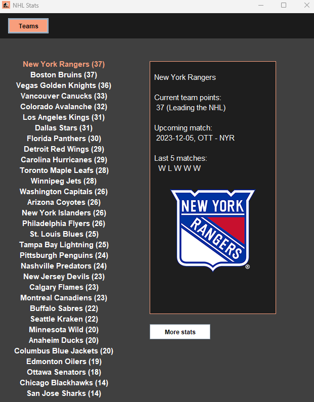
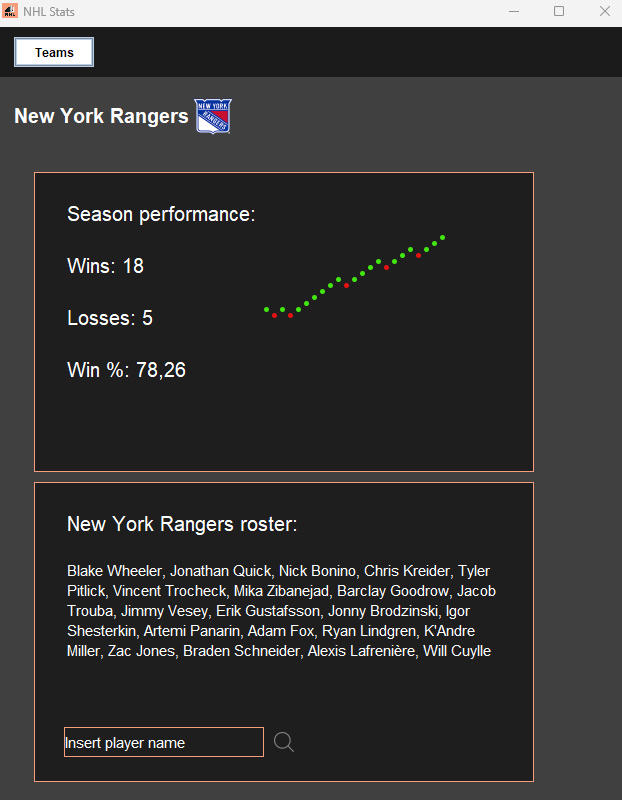

## NHL Stats

**Credits:**

Shoutout Drew Hynes for documenting the NHL API: https://gitlab.com/dword4/nhlapi

***

**Explanation:**

This is a desktop app for viewing live data about the NHL. It includes:
 - Season statistics (standings)
 - Team statistics (points, wins, losses, roster)
 - Player statistics (points, goals, assists)

 - A small betting game to guess whether a team will win or lose their next game.

***

**Try it:**

Simply download everything in the repository and run NHL.jar. Make sure you have java installed and an internet connection.

***

**Structure:**

- The *images* folder contains the images used in the program

- The *DataFetcher.java* file contains all calls made to the api

- The *App.java* file contains all visual elements and logic of the application

- The *Team.java* file contains the data structure thats mainly used in the program for data storage and retrieval

- The *Player.java* file contains the data structure for a player

- The *Betting.java* file contains all logic related to the betting game.

***

**Screenshots:**

Page 1:

Page 2:

***