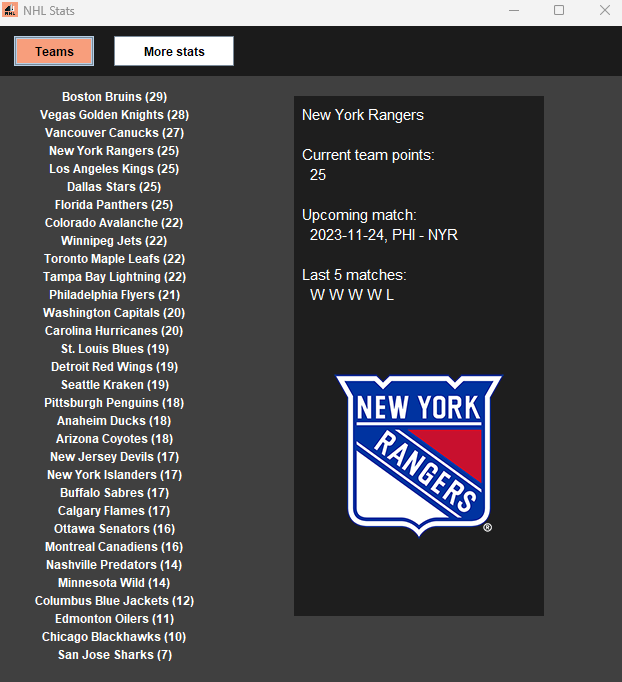
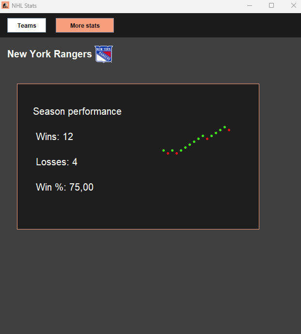

## NHL Stats

**Credits:**

Shoutout Drew Hynes for documenting the NHL API: https://gitlab.com/dword4/nhlapi

**Explanation:**

The *images* folder contains the images used in the program

The *APIStuff.java* file contains all the calls made to the api

The *App.java* contains all visual elements and logic of the application

The *Team.java* contains the data structure thats mainly used in the program for data storage and retrieval

The *Player.java* contains the data structure for a player.

**Screenshots:**

Page 1:

Page 2:

## Try it

Simply download everything in the repository and run NHL.jar. Make sure you have java installed and an internet connection.